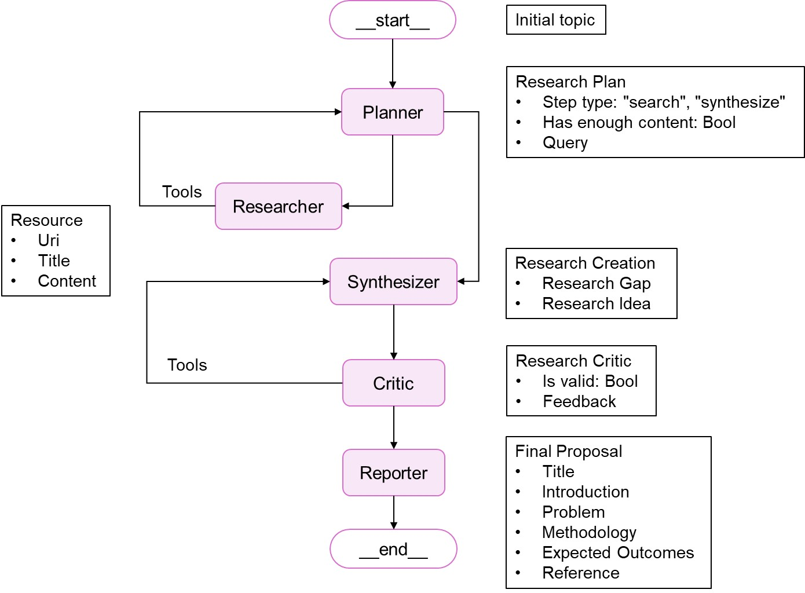

# Research Proposal Agent

> Intelligent Academic Research Proposal Generation System - Automated research proposal creation using multi-agent architecture and LLMs



## Project Overview

Research Proposal Agent is an intelligent academic research proposal generation tool based on multi-agent systems. By integrating multiple specialized AI agents, the system can automatically conduct literature research, identify research gaps, generate innovative research ideas, and output structured research proposals.

### Core Features

-  **Multi-Agent Collaboration**: Integrates five specialized agents - Planner, Researcher, Synthesizer, Critic, and Reporter
-  **Real-time Literature Search**: Automatically searches and analyzes the latest academic literature
-  **Structured Output**: Generates complete proposals including research background, methodology, and expected outcomes
-  **Iterative Optimization**: Continuously improves research quality through critic agent feedback
-  **Multi-Model Support**: Supports Ollama (local), OpenAI, and Google Gemini models
-  **Web Interface**: Provides modern real-time interactive interface

##  System Architecture

```
AI Research Proposal Generator
├──  Planner Agent      # Planning Agent - Develops research strategies
├──  Researcher Agent   # Research Agent - Executes literature retrieval
├──  Synthesizer Agent  # Synthesis Agent - Identifies research gaps and generates ideas
├──  Critic Agent       # Critic Agent - Quality assessment and feedback
└──  Reporter Agent     # Reporter Agent - Generates final reports
```

### Workflow

1. **Requirement Analysis**: User inputs research topic
2. **Strategy Planning**: Planner Agent analyzes and develops research strategy
3. **Literature Retrieval**: Researcher Agent searches for relevant academic resources
4. **Gap Analysis & Idea Generation**: Synthesizer Agent identifies research gaps and proposes innovative ideas
5. **Quality Assessment**: Critic Agent evaluates research innovation and feasibility
6. **Report Generation**: Reporter Agent outputs the final research proposal

##  Project Structure

```
├── main.py                     # FastAPI main application
├── app/
│   └── research_agent_app.py   # Core research agent application
├── src/
│   ├── agents/                 # Agent modules
│   │   ├── planner.py         # Planner agent
│   │   ├── researcher.py      # Researcher agent
│   │   ├── synthesizer.py     # Synthesizer agent
│   │   ├── critic.py          # Critic agent
│   │   └── reporter.py        # Reporter agent
│   ├── config/                # Configuration modules
│   │   ├── config.py          # System configuration
│   │   └── prompt.py          # Prompt templates
│   ├── state/                 # State management
│   │   └── schema.py          # Data model definitions
│   └── tools/                 # Tool modules
│       └── crawl_search.py    # Web crawling and search tools
├── static/                    # Frontend resources
│   ├── index.html            # Main page
│   ├── styles.css            # Style sheets
│   └── script.js             # Interactive scripts
└── image/
    └── flowchart.jpg         # System workflow diagram
```

## Usage Instructions

1. **Set access key**: Enter the access key in the settings panel (default: 123)
2. **Select AI model**: Choose local Ollama or cloud API models as needed
3. **Input research topic**: Describe your research area of interest in the input box
4. **Start generation**: The system will automatically perform multi-stage research proposal generation
5. **Real-time monitoring**: View generation progress and intermediate results through WebSocket connection

##  Technology Stack

### Backend Technologies
- **FastAPI**: High-performance asynchronous web framework
- **LangChain**: LLM application development framework
- **LangGraph**: Agent workflow orchestration
- **Tavily Search**: Academic literature search API
- **Pydantic**: Data validation and serialization

### Frontend Technologies
- **Vanilla JavaScript**: Interactive logic implementation
- **WebSocket**: Real-time communication
- **CSS3**: Modern UI design
- **Font Awesome**: Icon library

### AI Model Support
- **Ollama**: Locally deployed open-source models
- **OpenAI GPT**: Commercial cloud API
- **Google Gemini**: Google's multimodal AI model


##  Use Cases

### Academic Research
- PhD/Master's thesis proposal writing
- Research grant application writing
- Academic conference paper conceptualization

### Industrial R&D
- Technology innovation direction research
- Product development planning
- Market opportunity analysis

### Education & Training
- Research methodology teaching
- Academic writing guidance
- Innovation thinking training